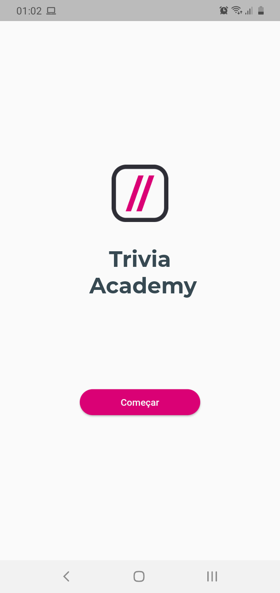
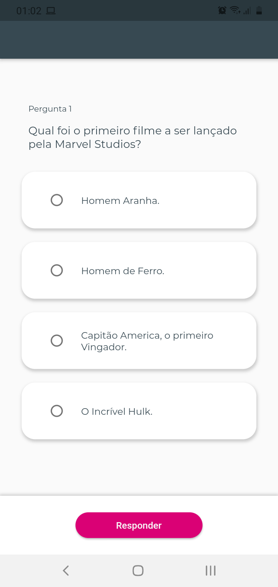
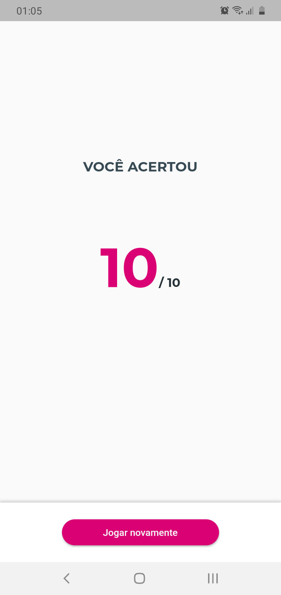
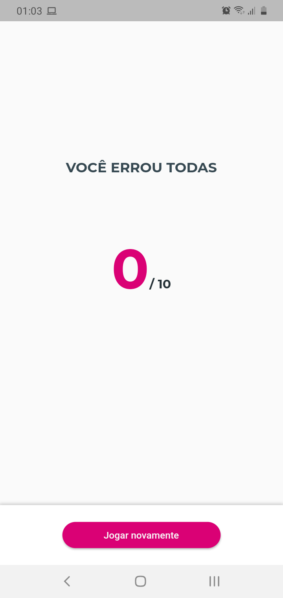

<h1 align="center">
 
  
 
   Trivia Academy 
</h1>

 Aplicativo Quiz, perguntas e respostas 

  

  

[//]: # (Adicione seus gifs / imagens aqui:)

 
   

   
  
  
  
  

## **Informações:**
[//]: # (Descreva seu objetivo e o que foi usado no projeto:)

* Projeto criado através da Inmersão de Flutter da Cubos Academy.
* Todos os dados no app são mockados.
* OBS: Este projeto, não foi otimizado para IOs, porém pode rodar normalmente.

<!-- ## **How to reach me:**
[//]: # (Adicione suas redes:)

[Instagram - Pessoal](https://www.instagram.com/dannbrandao_)

 -->

## **Linguagens e Ferramentas:**
[//]: # (Adicione os recursos do seu projeto aqui:)

- <code></code> **Flutter**
- <code></code> **Dart**

## Iniciar Projeto
[//]: # (Descreva aqui a forma de usar / instalar seu projeto:)

1° Clone este repo usando: git clone `https://github.com/brandaoti/trivia_academy.git`  
2° Mova-se para o diretório apropriado: `cd trivia_academy`  
3° digite `flutter run` para instalar as dependência e apk  

* ### Obs: Importante: antes do 3° passo <strong>conectar um aparelho físico via cabo ou emulador</strong>.
        

## License

Este projeto está licenciado sob a Licença MIT - consulte a [LICENSE](https://choosealicense.com/licenses/mit/) página para detalhes.
